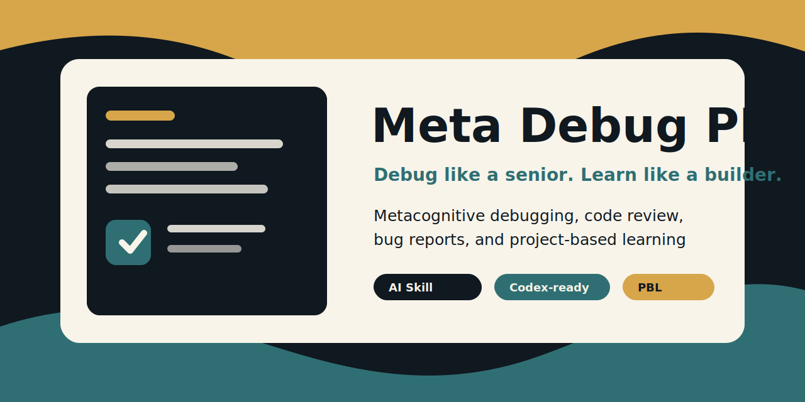

# Meta Debug PBL Skill



[Leer en español](#espanol)

**Debug like a senior. Learn like a builder.**

`meta-debug-pbl` is a metacognitive debugging and Project-Based Learning skill for Codex and Claude AI coding agents.

It helps an AI coding assistant explain what failed, why it failed, how to fix it, how to verify it, and what a programming student should learn from the repair.

## What It Does

- Turns debugging sessions into clear diagnosis, fix, verification, prevention, and learning notes.
- Reviews code with prioritized findings instead of vague feedback.
- Creates reusable Markdown bug reports and task reports.
- Makes technical reasoning easier to follow for learners, self-taught developers, and neurodivergent programmers.
- Keeps explanations transparent without exposing hidden chain-of-thought.

## Why It Exists

Most AI coding help gives an answer. This skill makes the answer teachable.

It is designed for moments where the user does not only want working code, but also wants to understand the failure pattern, recognize it next time, and document the fix as part of a real project workflow.

## Best For

| Workflow | What the skill adds |
| --- | --- |
| Debugging | Symptom, expected behavior, root cause, fix, verification, prevention |
| Code review | Severity-based findings with concrete fixes |
| Project-Based Learning | Student-friendly explanations tied to real code |
| Bug documentation | Markdown reports that preserve context and lessons |
| Refactoring | Safer improvement options with tradeoffs |
| Technical mentoring | Clear, structured, neurodivergent-friendly explanations |

## Install

Clone this repository, then place the skill folder where your agent can discover local skills.

For Codex:

```bash
mkdir -p ~/.codex/skills
cp -R meta-debug-pbl-skill ~/.codex/skills/meta-debug-pbl
```

For agents that read `~/.agents/skills`:

```bash
mkdir -p ~/.agents/skills
cp -R meta-debug-pbl-skill ~/.agents/skills/meta-debug-pbl
```

Restart the agent session after copying the folder.

## Usage

Invoke it explicitly:

```text
Use $meta-debug-pbl to debug this error and explain it like a programming mentor.
```

Use it for code review:

```text
Use $meta-debug-pbl to review this function. Prioritize bugs and explain the lesson learned.
```

Use it for documentation:

```text
Use $meta-debug-pbl to create a Markdown bug report for the issue we just fixed.
```

See [`examples/`](examples/) for prompt examples and expected response shapes.

## Repository Structure

```text
.
├── SKILL.md                 # Skill instructions loaded by the agent
├── agents/
│   └── openai.yaml          # Optional interface metadata
├── assets/
│   └── banner.svg           # Project banner used in this README
├── examples/
│   ├── bug-report.md
│   ├── code-review.md
│   └── debugging.md
└── README.md
```

## Who This Is For

- Developers who want AI help that teaches instead of only patching.
- Students learning by building real projects.
- Mentors who want repeatable debugging and review formats.
- Neurodivergent developers who benefit from explicit structure, visible assumptions, and concrete next steps.
- AI agent users building a personal library of reusable local skills.

## License

MIT License © 2026 D4vRAM369. See [`LICENSE`](LICENSE).

<a id="espanol"></a>

---

# Meta Debug PBL Skill en español

[Back to English](#meta-debug-pbl-skill)

**Depura como senior. Aprende construyendo.**

`meta-debug-pbl` es una skill de depuración metacognitiva y Project-Based Learning para agentes de programación con IA como Codex y Claude.

Ayuda a que un asistente de programación explique qué falló, por qué falló, cómo corregirlo, cómo verificarlo y qué debería aprender una persona estudiante de programación después de arreglarlo.

## Qué Hace

- Convierte sesiones de debugging en diagnóstico, corrección, verificación, prevención y notas de aprendizaje.
- Revisa código con hallazgos priorizados en vez de comentarios vagos.
- Crea reportes Markdown reutilizables para bugs y tareas.
- Hace que el razonamiento técnico sea más fácil de seguir para estudiantes, personas autodidactas y programadores neurodivergentes.
- Mantiene explicaciones transparentes sin exponer razonamiento interno oculto.

## Por Qué Existe

Mucha ayuda de IA entrega una respuesta. Esta skill hace que la respuesta también enseñe.

Está pensada para situaciones donde no solo quieres código funcionando, sino entender el patrón del error, reconocerlo la próxima vez y documentar la solución dentro de un flujo real de proyecto.

## Ideal Para

| Flujo | Qué aporta la skill |
| --- | --- |
| Debugging | Síntoma, comportamiento esperado, causa raíz, arreglo, verificación y prevención |
| Revisión de código | Hallazgos por severidad con correcciones concretas |
| Project-Based Learning | Explicaciones didácticas conectadas con código real |
| Documentación de bugs | Reportes Markdown que conservan contexto y aprendizajes |
| Refactorización | Opciones de mejora más seguras con tradeoffs |
| Mentoría técnica | Explicaciones claras, estructuradas y neurodivergent-friendly |

## Instalación

Clona este repositorio y coloca la carpeta de la skill donde tu agente pueda descubrir skills locales.

Para Codex:

```bash
mkdir -p ~/.codex/skills
cp -R meta-debug-pbl-skill ~/.codex/skills/meta-debug-pbl
```

Para agentes que leen `~/.agents/skills`:

```bash
mkdir -p ~/.agents/skills
cp -R meta-debug-pbl-skill ~/.agents/skills/meta-debug-pbl
```

Reinicia la sesión del agente después de copiar la carpeta.

## Uso

Invócala explícitamente:

```text
Usa $meta-debug-pbl para depurar este error y explicarlo como mentor de programación.
```

Úsala para revisar código:

```text
Usa $meta-debug-pbl para revisar esta función. Prioriza bugs y explica la lección aprendida.
```

Úsala para documentar:

```text
Usa $meta-debug-pbl para crear un reporte Markdown del bug que acabamos de corregir.
```

Mira [`examples/`](examples/) para ejemplos de prompts y formas esperadas de respuesta.

## Estructura Del Repositorio

```text
.
├── SKILL.md                 # Instrucciones de la skill cargadas por el agente
├── agents/
│   └── openai.yaml          # Metadatos opcionales de interfaz
├── assets/
│   └── banner.svg           # Banner del proyecto usado en este README
├── examples/
│   ├── bug-report.md
│   ├── code-review.md
│   └── debugging.md
└── README.md
```

## Para Quién Es

- Desarrolladores que quieren ayuda de IA que enseñe, no solo que parchee.
- Estudiantes que aprenden creando proyectos reales.
- Mentores que quieren formatos repetibles para debugging y revisión.
- Programadores neurodivergentes que se benefician de estructura explícita, supuestos visibles y próximos pasos concretos.
- Usuarios de agentes de IA que están creando una biblioteca personal de skills locales reutilizables.

## Licencia

Licencia MIT © 2026 D4vRAM369. Consulta [`LICENSE`](LICENSE).
